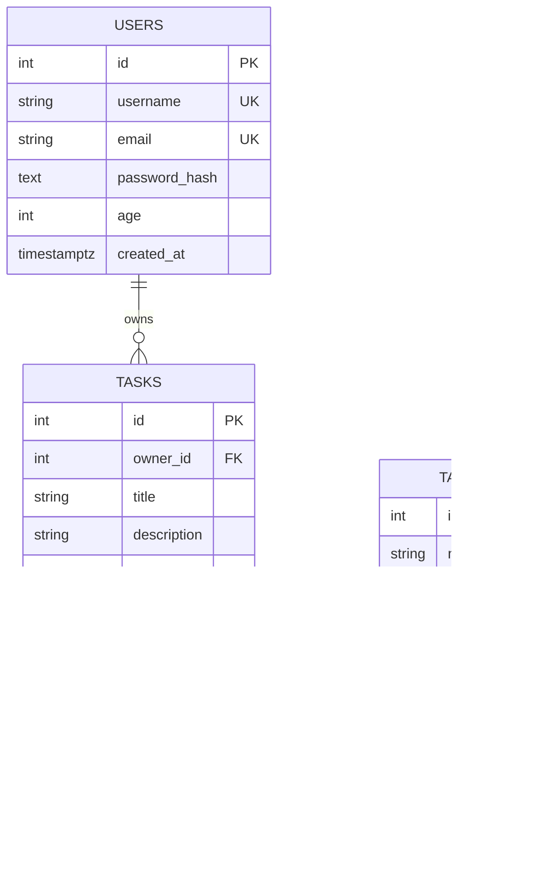

```mermaid
erDiagram
    USERS ||--o{ TASKS : owns
    TASKS ||--o{ TASK_TAGS : has
    TAGS  ||--o{ TASK_TAGS : labels

    USERS {
        int id PK
        string username UK
        string email UK
        text password_hash
        int age
        timestamptz created_at
    }
    TASKS {
        int id PK
        int owner_id FK
        string title
        string description
        enum priority
        bool completed
        timestamptz created_at
    }
    TAGS {
        int id PK
        string name UK
    }
    TASK_TAGS {
        int task_id PK, FK
        int tag_id PK, FK
    }
```